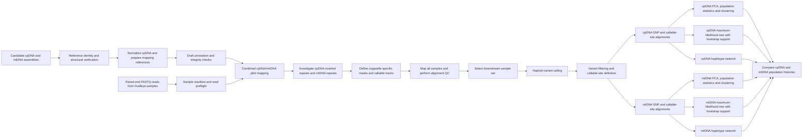

# Dudleya cpDNA and mtDNA Bioinformatics Workflow

## Purpose

This workflow verifies candidate *Dudleya setchellii* chloroplast and mitochondrial reference sequences, maps resequencing reads from *Dudleya* samples to those references, builds separate cpDNA and mtDNA alignments, and reconstructs organelle population structure and phylogenetic relationships.

The chloroplast and mitochondrial genomes are analyzed separately after initial combined-reference screening because they differ in genome structure, repeat content, callable sequence, and number of informative variants.

## Figure-ready workflow



## Condensed workflow for a manuscript figure

```text
Candidate organelle assemblies
        ↓
Reference identity, structural verification and draft annotation
        ↓
Paired-end read QC and combined cpDNA/mtDNA pilot mapping
        ↓
Repeat investigation and organelle-specific callable masks
        ↓
All-sample mapping and alignment QC
        ↓
Haploid variant calling and filtering
        ↓
Separate cpDNA and mtDNA SNP/callable-site alignments
        ↓
PCA ─ Population statistics ─ Clustering ─ Haplotype networks
        ↓
Bootstrap-supported maximum-likelihood trees
        ↓
Comparison of chloroplast and mitochondrial population histories
```

## Detailed workflow

### 1. Candidate organelle reference verification

Candidate chloroplast and mitochondrial assemblies are evaluated before population analysis.

The verification package performs:

- whole-genome comparison against public chloroplast and mitochondrial references;
- independent sequence-similarity checks;
- cross-organelle checks to confirm that cpDNA and mtDNA labels are not swapped;
- focused comparison of the chloroplast candidate with `NC_085682.1`;
- detection and removal of the chloroplast terminal duplication;
- rotation of the normalized chloroplast sequence to a public-reference origin;
- homology-based draft annotation;
- annotation-integrity checks for coding intervals and other features.

Primary mapping references:

```text
dudleya_organelle_reference_verification/references/chloroplast.normalized.fa
dudleya_organelle_reference_verification/references/mitochondria.fa
dudleya_organelle_reference_verification/references/dudleya_cp_mt.fa
```

### 2. Sample manifest and preflight validation

The pipeline builds a sample manifest from the paired FASTQ files and checks:

- sample identifiers;
- R1/R2 pairing;
- file presence and naming consistency;
- reference availability;
- required output directories and dependencies.

Output:

```text
dudleya_organelle_alignment_pipeline/results/00_manifest/
```

### 3. Reference indexing and pilot-sample selection

The normalized cpDNA reference, mtDNA reference, and combined reference are prepared for mapping. A representative pilot subset is selected to test mapping behavior before processing the complete dataset.

Output:

```text
dudleya_organelle_alignment_pipeline/results/01_reference_pilot/
```

### 4. Pilot organelle mapping

A pilot set of samples is mapped to the combined cpDNA/mtDNA reference. This stage evaluates:

- organelle read recovery;
- mapping quality;
- depth and breadth of coverage;
- possible cross-mapping between cpDNA and mtDNA;
- problematic repeat-rich or ambiguous regions.

Output:

```text
dudleya_organelle_alignment_pipeline/results/02_pilot_alignment/
```

### 5. Organelle-specific structural investigations

The pilot results are used for two separate investigations.

#### mtDNA

The mitochondrial candidate is examined for repeat-rich, ambiguously placed, or poorly unique regions. These regions are distinguished from the high-confidence unique mitochondrial track used for population-genomic interpretation.

#### cpDNA

The chloroplast inverted-repeat regions and normalized circular structure are checked to prevent duplicated or ambiguous positions from being treated as independent population variants.

Outputs:

```text
dudleya_organelle_alignment_pipeline/results/03_mtdna_investigation/
dudleya_organelle_alignment_pipeline/results/04_cpdna_investigation/
```

### 6. Analysis masks and callable tracks

The structural investigations are converted into explicit masks and analysis tracks. These determine which positions are eligible for:

- coverage summaries;
- variant calling;
- SNP filtering;
- consensus-sequence generation;
- population-genetic interpretation.

The cpDNA and mtDNA tracks are kept separate. The mitochondrial population analysis emphasizes the high-confidence unique track rather than repeat-rich regions.

Output:

```text
dudleya_organelle_alignment_pipeline/results/05_analysis_masks/
```

### 7. All-sample organelle mapping and QC

All usable paired-end read sets are mapped to the verified organelle references. Track-aware quality control summarizes:

- mapped reads;
- mapping rate;
- depth of coverage;
- breadth of coverage;
- organelle-specific callable sequence;
- sample-level QC failures or exclusions.

Output:

```text
dudleya_organelle_alignment_pipeline/results/06_all_sample_alignment/
```

### 8. Downstream sample selection

The mapping and coverage metrics are used to define the final included sample set. Exclusions and their reasons are recorded rather than silently dropping samples.

Output:

```text
dudleya_organelle_alignment_pipeline/results/07_downstream_sample_set/
```

The exact sample count is run-specific; the current full rerun contains 278 downstream samples.

### 9. Haploid variant calling

Variants are called separately for cpDNA and mtDNA using haploid assumptions appropriate for organelle genomes.

The output preserves provenance for:

- input alignment files;
- reference and analysis track;
- calling parameters;
- generated variant files.

Output:

```text
dudleya_organelle_alignment_pipeline/results/08_variant_calling/
```

### 10. Variant filtering and callable-site definition

Raw calls are filtered using depth, quality, missingness, allelic state, and track-specific criteria. The pipeline also defines the callable nonvariant sites needed to build full consensus alignments.

Output:

```text
dudleya_organelle_alignment_pipeline/results/09_variant_filtering/
```

### 11. Separate cpDNA and mtDNA alignments

Two alignment types are generated for each organelle.

#### SNP-only alignments

Contain filtered polymorphic sites and are used for PCA, clustering, haplotype summaries, and some distance-based analyses.

```text
dudleya_organelle_alignment_pipeline/results/10_snp_alignment/
```

#### Callable-site consensus alignments

Contain the full set of retained callable positions, including invariant sites. These are used for maximum-likelihood phylogenetic inference with an explicit substitution model.

```text
dudleya_organelle_alignment_pipeline/results/11_callable_consensus/
```

### 12. Exploratory and final phylogenetic inference

Initial maximum-likelihood trees are generated without the final bootstrap analysis as a rapid inspection step.

```text
dudleya_organelle_alignment_pipeline/results/12_phylogenetic_tree/
```

The final cpDNA and mtDNA trees are then inferred separately using maximum likelihood under `GTR+F+G4`, with 1,000 ultrafast bootstrap replicates and BNNI correction.

```text
dudleya_organelle_alignment_pipeline/results/19_bootstrap_phylogenetic_tree/
```

Static PNG, PDF, and SVG tree figures are produced from the final bootstrap-supported trees.

```text
dudleya_organelle_alignment_pipeline/results/20_bootstrap_tree_visualization/
```

### 13. Principal-component analysis

PCA is performed separately on the filtered cpDNA and mtDNA SNP alignments. The plots summarize major axes of organelle genetic variation and allow samples to be compared by available population or taxonomic metadata.

Output:

```text
dudleya_organelle_alignment_pipeline/results/15_pca/
```

### 14. Organelle clustering

An ADMIXTURE-style analysis is used as a visualization of organelle haplotype clustering. Haploid calls are encoded as pseudo-diploid homozygous genotypes for compatibility with the software.

The final analysis uses five seeded replicates for each tested K and chooses the preferred K using mean cross-validation error.

Output:

```text
dudleya_organelle_alignment_pipeline/results/18_admixture_replicates/
```

This result must not be interpreted as conventional recombining nuclear admixture. It is a descriptive clustering view of nonrecombining organelle haplotypes.

### 15. Population-genetic summaries

For both cpDNA and mtDNA, the pipeline calculates population-level summaries such as:

- sample count;
- number of haplotypes;
- haplotype diversity;
- nucleotide diversity;
- private variants;
- pairwise population differentiation.

Output:

```text
dudleya_organelle_alignment_pipeline/results/17_population_genetics/
```

### 16. Haplotype networks

Haploid-native cpDNA and mtDNA haplotype networks are generated as a complementary visualization. PopART-compatible exports are also written for external inspection and editing.

Output:

```text
dudleya_organelle_alignment_pipeline/results/21_haplotype_network/
```

### 17. Integrated interpretation

The final interpretation compares cpDNA and mtDNA patterns across:

- PCA clusters;
- maximum-likelihood trees;
- bootstrap support;
- population differentiation;
- clustering results;
- haplotype networks.

Agreement between the two organelles supports a shared geographic history. Discordance can indicate differences in lineage sorting, introgression, organelle capture, mutation rate, effective population size, or the amount of informative sequence available.

## Primary outputs

```text
results/10_snp_alignment/                 Filtered cpDNA and mtDNA SNP alignments
results/11_callable_consensus/            Full callable-site consensus alignments
results/15_pca/                           PCA coordinates and figures
results/17_population_genetics/           Population summaries and pairwise differentiation
results/18_admixture_replicates/          Final replicate-based clustering figures
results/19_bootstrap_phylogenetic_tree/   Final bootstrap-supported tree files
results/20_bootstrap_tree_visualization/  Final rendered tree figures
results/21_haplotype_network/             Haplotype networks and PopART exports
```

## Interpretation limitations

- Chloroplast and mitochondrial genomes represent organelle histories, not the complete nuclear species history.
- Organelle genomes are effectively linked, nonrecombining units; thousands of sites do not represent thousands of independent loci.
- Chloroplast and mitochondrial inheritance may differ among plant lineages and should not be assumed without biological support.
- Introgression or organelle capture can produce strong organelle trees that disagree with nuclear relationships.
- The mtDNA analysis excludes repeat-rich ambiguous regions and therefore represents the high-confidence unique mitochondrial track.
- Draft annotations are suitable for feature-aware interpretation and QC but are not equivalent to fully curated GenBank annotations.
- Bootstrap support measures consistency under the selected data and model; it does not by itself establish the true species history.

## Repository stage index

The authoritative stage-by-stage implementation is documented in:

```text
dudleya_organelle_alignment_pipeline/PROCESS.md
```
